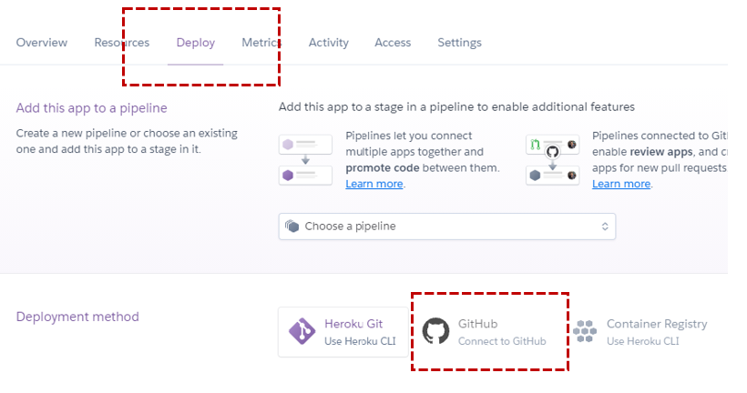
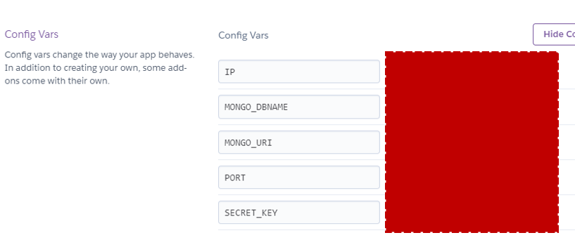
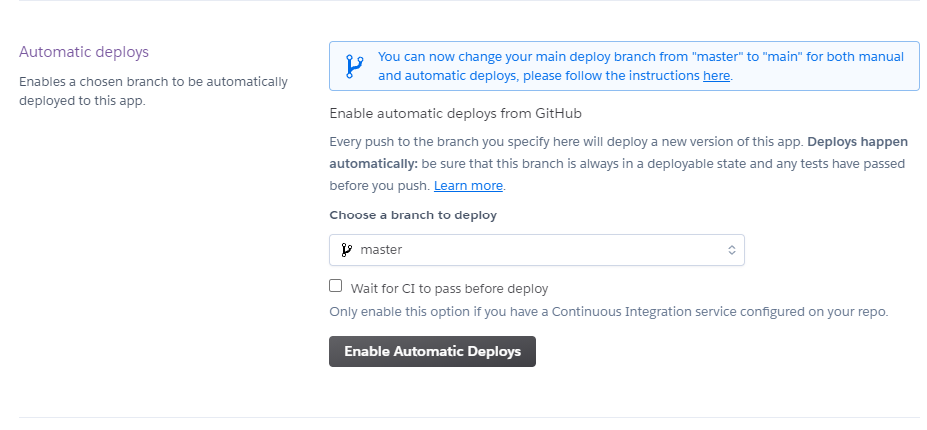

# **HolidayHub**
<!-- short intro description of the site -->

## **UX**
The **five planes of user experience design** developed by Jesse James Garrett was used as the conceptual framework for the development process of this site

### **Strategy Plane**

<!-- who is the site owner and who is the site visitor -->

### **User Stories**

#### Site Viewer
As a user viewing this site, 
1. I want to be able to create an account on HolidayHub
2. I want to be able to log in to my account on HolidayHub
3. I want to be able to log out of my account on HolidayHub
4. I want to be view my profile on HolidayHub
5. I want to write a review on HolidayHub
6. I want to edit a review on HolidayHub
7. I want to delete a review on HolidayHub
8. I want to see other users reviews on HolidayHub
9. I want to see other users reviews by country on HolidayHub
10. I want to see other users reviews by location on HolidayHub
11. I want to see the best locations by holiday type on HolidayHub
12. I want to see the cheapest rated locations on HolidayHub
13. I want to see the best rated countries on HolidayHub
14. I want the process of writing a review to be simple and intuitive
15. I want the process of reading another users' review to be interesting and visually appealling
16. I want to view another person's profile on HolidayHub

As the business owner of this site,
1. I want to provide unbiased, user driven travel advice
2. I want to create opportunities to generate revenue by promoting traffic to affiliate links accomodation booking sites

### **Scope Plane**
To plan out the scope of the site, I compiled a list of features that were needed in order to satisify the user stories of the site. These were the features that I would need completed for a minimun viable product

<!-- list of features planned for the site -->

<!-- planned technologies for use -->

### **Structure Plane***

<!-- short intro to how structure was thought out -->

### Database Design & Schema

#### Site Structure

### **Skeleton Plane***

<!-- wireframes -->

### **Surface Plane***

<!-- aesthetics -->
<!-- color palette -->

### **Features***

#### Existing Features

#### Features Left to Implement

### **Technologies Used***

### **Testing***

### **Version Control***
* To begin the project, I created a remote repository on Github by choosing the **New Repository** button and following the on screen steps.
* I then created a local repository using Git:
   *  I created a directory on my computer called **MS3**
   *  I opened the directory using VS code and started a terminal
   *  I initialized the directory as a Git repository using the command `git init`
   *  I added a README to the file using the command `git add README.md`
   *  I then created an index.html file in the directory and started working on the site
   *  When I was ready to commit my first set of changes, I used the `git add .` and the `git commit -m "Initial commit"` commands in my terminal
   
* In order to store my commits remotely on Github, I linked my local repository to the remote repository:
   * In my VS code terminal, I used the command `git remote add origin https://github.com/steharr/ms2-holiday-review` and `git remote -v`

* Throughout the development process, I would regularly push my commits to Github using the `git push` command 

* For this project, there were some environment variables I needed to keep hidden so that they werent pushed publicly to Github. For example, the **MONGO_URI** that I was using to connect to my database and the **SECRET_KEY** needed for flashing messages in flask. For this I created an `env.py` which was stored on my local machine. All variables which needed to be hidden were stored in this file. I then added the file to a `.gitignore` file so that whenever I was committing files, the `env.py` file would never be included. In order to access these environment variables when the app was running on a development server on my computer, my code would import the `env.py` module. On the deployed app, these variables are stored and extracted from Heroku. Details of how this was setup are in the next section

* In order to help me better manage the dependencies of my project, I created a virtual environment in the **MS3** directory I was working from. I did this by using the python terminal command `python -m venv .venv`. In VSCode I then selected this virtual environment as my python interpreter. This enabled me to have a better overview of exactly what the dependencies were being used by my project since I already had multiple uneccessary modules installed on my computer. If I did not take this step, certain uneccessary modules may have been included in the `requirments.txt` file I created while deploying my website to Heroku. I then added this `.venv` environment that was created to my `.gitignore` file so that it wouldnt be commited to github.

### **Deployment**
This website is deployed on [Heroku](https://id.heroku.com/login). The steps taken to deploy the site are detailed below:

1. In order to prepare my website before it was deployed to Heroku, I first created a `requirements.txt` file using the pip command `pip freeze > requirements.txt` in a terminal in VSCode. This extracted all the dependencies of my project that were installed in my virtual environment into a .txt file which Heroku could use to build my project when it is being deployed.

2. I also created a `Procfile` which contained the instruction: `web: python app.py`. This instructs my applications dynos on Heroku to build a web server powered by python and use the `app.py` as the file which is to be run on this server.

3. Then in Heroku, I created a new app called **ms3-holiday-review** and selected Europe as the region.

4. I then connected my Heroku app to my previously created GitHub repository by choosing the **Connect to GitHub** option in the **Deploy** section of the Heroku dahsboard. I searched for my GitHub repo by name using the search box provided.  
 

5. At this point I set up **config vars** in the **Settings** section of Heroku dahsboard. These are the environment variables that my code needs to work. As mentioned previously, on my local machine these are stored in `env.py` and never pushed to GitHub.  
 

6. Once the app setup was complete, I set up **automatic deploys** for my app. I did this by choosing the **Enable Automatic Deploys** option in the **Deploy** section of the Heroku dashboard. This meant that anytime I pushed code to GitHub, Heroku would automatically build my app. It is also possible to manually deploy a branch in Heroku by using the **Manual deploy** options in the same section on the dashboard  
 

**NOTE:** *Normally for a deployed website, it is important that `debug` parameter for the `app.run` flask method is set to False. Since this was a study project, I kept it equal to True up until the point where I was submitting the project for assessment, where it was then changed to False*

### **Credits**

### **Acknowledgments**

* My mentor, **Spencer Barriball** who guided me through this project.
* Fellow **Code Institute** students on Slack who helped troubleshoot issues and give me inspiration for this project 