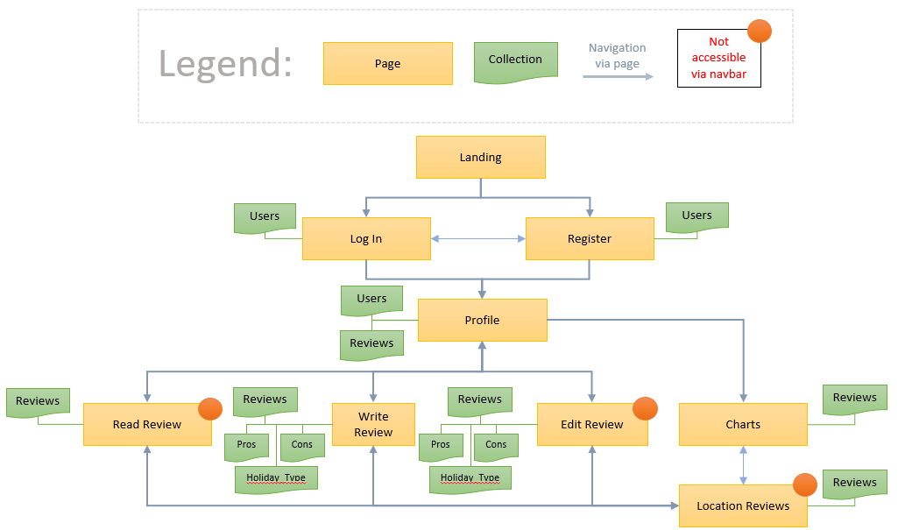

# **[HolidayHub](https://ms3-holiday-review.herokuapp.com/)**
 

HolidayHub is a holiday review website where users can create an account and write reviews on locations they have travelled to. Review data is aggregated in the back end of the site in order to provide review based travel advice on the best locations to visit. This advice is presented in the form of charts on the website, where the user can see what are the best rated locations by all site users.

This project was completed for my **Code Institute Milestone 3 Project**. The site is built using **HTML, CSS, Bootstrap & Javascript** for the front end and **Python, Mongodb and Flask** for the back end. It is deployed on Heroku and is available [here](https://ms3-holiday-review.herokuapp.com/)

## **UX**
The **five planes of user experience design** developed by Jesse James Garrett was used as the conceptual framework for the development process of this site

### **Strategy Plane**
The process of choosing a destination for your next holiday can sometimes be overwhelming. Holiday review sites such as [Tripadvisor](https://www.tripadvisor.ie/) and [HolidayTruths](https://www.holidaytruths.co.uk/) can have cluttered interfaces which have an abundance of data that the viewer needs to navigate through. Other times when searching for options online, users will come accross websites with curated lists created by travel agent companies. The validity of these lists can sometimes be questionable; Could these list contain locations which are affiliated with the Travel Agent? Could **Location A** be at the top of a list purely because the website owners are trying to sell holidays to a partnered resort at that location?

The site owner of HolidayHub is looking to break into this market with a holiday review website with an intuitive interface that provides users with unbiased, data driven travel ideas. The unique selling point of the site is to be a **Charts** page which aggregates user reviews and gives a complete and clear picture of where the best places to go are. Its important for the site owner that the website develops an active userbase who feel like they are connected to a wider community of reviewers.

Typical site viewers for **HolidayHub** are:
* People who prefer to go to a holiday destinations based off recomendations they have been given from others
* People who get lost in the complex interfaces of current holiday review websites when trying to make important holiday decisions
* People who have decided that they want to go on Holidays but havent yet decided **where** to go yet. They are yearning for a reliable solution which makes this decision making process more clear cut than it currently is

### **User Stories**
Based on the descriptions and demands of the site owners and viewers, the following user stories were compiled for this project.

#### Site Viewer
As a user viewing this site, 
1. I want to be able to create an account on HolidayHub
2. I want to be able to log in to my account on HolidayHub
3. I want to be able to log out of my account on HolidayHub
4. I want to be view my profile on HolidayHub
5. I want to write a review on HolidayHub
6. I want to edit a review on HolidayHub
7. I want to delete a review on HolidayHub
8. I want to see other users reviews on HolidayHub
9. I want to see other users reviews by country on HolidayHub
10. I want to see other users reviews by location on HolidayHub
11. I want to see the best locations for food on HolidayHub
12. I want to see the cheapest rated locations on HolidayHub
13. I want to see the best rated countries on HolidayHub
14. I want the process of writing a review to be simple and intuitive
15. I want the process of reading another users' review to be interesting and visually appealling
16. I want to view another person's profile on HolidayHub

As the business owner of this site,
1. I want to provide unbiased, user driven travel advice
2. I want to create opportunities to generate revenue by promoting traffic to affiliate links accomodation booking sites

### **Scope Plane**
To plan out the scope of the site, I compiled a list of features that were needed in order to satisify the user stories of the site. These were the features that I would need completed for a minimun viable product and ranked by order of importance. An additional group of ***Nice to have*** features were also compiled that if feasible could be targetted to further improve the overall experience of the site

**Group 1: Minimum Viable Product Features**  
|Feature|Description|Importance (1-10)|
|:--:|:--:|:--:|
|Account Creation Page|The ability to create an account|10|
|Account Login Page|The ability to log out of an account|10|
|Write Review Page|The ability to write a review|10|
|Structured Review Format|For the purpose of agreggating data, the form used for writing reviews needed to be well designed so that back end processing could be easily achieved|10|
|User Profile Page|A profile page for the user which is their starting point for navigating through the site|10|
|Charts Page|A Charts page showing aggregated review data|10|
|Affiliate Links|For the site owner to make money, they need to direct some traffic towards their affiliates|10|
|Edit Review Page|The ability for a user to change a review if desired|9|
|Visually Appealing Review Button Components|The review scores need to be displayed as icons e.g. Stars for overall rating or Coins for cost rating|9|
|Delete Review Page|The ability for a user to delete a review if desired|8|
|Defensive Programming|When a user chooses to delete a review, they must have option to revert their decision|8|
|Review Pros/Cons Selection|In order to develop charts based on certain data contained in a review, the review form needs to have buttons where users can choose what the holiday pros and cons were. For example if the user chose **food** as a Pro, that review would be considered in a chart for best places for food|7|
|Reviews by Country/Location Page|Users should be able to see all reviews for a particular destination so that they can fully consider all important information|7|
|Community Visibility|Users should be able to see another persons profile|7|

**Group 2: Nice to Have Features**  
|Feature|Description|Importance (1-10)|
|:--:|:--:|:--:|
|User Avatars|Displaying a user avatar in their profile|6|
|User Stats|Stats visible on a users' profile|6|
|User Classes/Types|Based on user preference, the traveller type of the user is visible on their profile|6|
|Profile Globe|A map of the world in the users' profile with reviewed countries highlighted|5|
|Admin User Privelages|Admin users have the ability to create their own charts, adjust categories that can be selected in reviews|5|

<!-- planned technologies for use -->

### **Structure Plane**
The structure plane was carried out in three steps: **Back End Design**, **Front End Design** & **Front End Relationships** 

#### **Back End Design:**  
For the back end of the site there are 5 collections:

* **Users**  
This collection stores details on the users chosen username and password. The username is stored as a string with lowercase characters.
For security purposes, the password is stored as a hashed password string on the database using the [Werkzeug](https://werkzeug.palletsprojects.com/en/2.0.x/) library that is included with Flask. Hashing provides a one way transformation of the password so there is protection if someone who gains unauthorized access to the database. The collection also contains some user stats that are obtained when the user first registers. In total there are 4 keys for each document in this collection:  
`username` - a string that contains the username of the user   
`password` - a string that contains the hashed password of the user   
`holiday_type` - a string that details what type of holiday the user has chosen as their favourite when registering    
`date_registered` - a string which details the date the user created an account **(dd mmm yyyy format)**

* **Pros**  
This collection holds all of the options available to the user to choose as a holiday pro when they are writing a review. There is 1 key for each document in this collection:  
`name` - a string name of the holiday pro e.g. food

* **Cons**  
This collection holds all of the options available to the user to choose as a holiday con when they are writing a review. There is 1 key for each document in this collection:  
`name` - a string name of the holiday con e.g. weather

* **Holiday_Type**  
This collection holds all of the traveller types that a user can be on the site. For each traveller type there is an associated holiday type. When a user firsts registers, they choose their favourite holiday type. Whenever they view their profile, the associated traveller type is displayed in their profile. There are 2 keys for each document in this collection:  
`holiday_type` - a string that details what type of holiday the user has chosen as their favourite when registering. Also is chosen whenever a user is submitting a review  
`traveller_type` - a string that details what type of traveller a user is based on what their chosen preferred holiday type is

* **Reviews**  
The reviews collection stores all information submitted in a review. There are 11 keys in this collection:  
`username` - A string which details the user that submitted the review  
`country` - A string which details the country being reviewed  
`location` - A string which details the town/city being reviewed  
`holiday_type` - A string which details the holiday type   
`holiday_pros` - An array which stores all pros chosen in the review  
`holiday_cons` - An array which stores all cons chosen in the review  
`rating` - An integer between (1-5) which gives the review rating  
`comment` - A string which details the town/city being reviewed  
`cost`- An integer between (1-3) which gives the review cost rating  
`time_visited` - A string which details the season which the town/city being reviewed was visited e.g. Summer
`date_reviewed` - A string which details the date that the review was created **(dd mmm yyyy format)**  

##### **Database Schema Diagram** 
The overview of the database schema and how each collection is related is shown below  

 

#### **Front End Design:** 
For the front end, I planned to create 10 html pages which extended from one base template.  

`index.html` - landing page for the site with a call to action encouraging viewers to register  
`register.html` - register form for the user to set up an account   
`login.html` - login form for the user to login to their account  
`profile.html` - profile page for the user  
`write_review.html` - form for the user to write a review    
`read_review.html` - page which shows a created review      
`edit_review.html` - form for the user to edit a review    
`charts.html` - aggregated review data in the form of charts  
`reviews.html` - a list of reviews per location or country    
 
#### **Front and Back End Relationships:**
The final planning for the structure plane involved creating a site plan which describes how the collections and the pages were connected and what were the navigation paths that the user could take through the site. This plan is shown below:

 

#### **Final Key Design Decisions**
In order to plan out the development stages and ensure that the all user stories were satisfied, I made some key design decisions early on:

* The site is designed to be **mobile first**. This decision was made in order to ensure it was easily accessible for all potential users.
* Since it is a full stack application with a large scope, I decided I needed to use the **Boostrap** framework in order to speed up the front end development as much as possible.
* I decided to focus primarily on **functionality over form**. If it was possible to achieve the desired user experience using a Bootstrap component with a minimal amount of customization, I would choose this over attempting to design the component from scratch. 

### **Skeleton Plane**
For the skeleton plane, wireframes were completed for each page of the website. Shown below:

* [Landing](documents/wireframes/landing.png)
* [Login](documents/wireframes/login.png)
* [Register](documents/wireframes/register.png)
* [Profile](documents/wireframes/profile.png)
* [Edit Review](documents/wireframes/edit_review.png)
* [Write Review](documents/wireframes/write_review.png)
* [Read Review](documents/wireframes/read_review.png)
* [Charts](documents/wireframes/charts.png)
* [Reviews](documents/wireframes/reviews.png)

### **Surface Plane**

**Color Palette**  
To create the color scheme of the site, I used the color palette generator [Coolors.](https://coolors.co/) I wanted to focus on using colors which could be associated with going on holidays. A typical activity for a holiday goer is to go to the beach. Therefore I chose a color palette which has shades similar to the color of sand. I also planned to use the Bootstrap standard [button components](https://getbootstrap.com/docs/5.1/components/buttons/) in my site as these had very distinct, eye catching color schemes. Therefore I needed to have a neutral color palette for my site so that these buttons would pop on the screen. The sandy color pallette was neutral enough to achieve this goal.

 

**Font**  
For the fonts of the site, I used the default Bootstrap font families of **Helvetica** and **Arial**. I found these fonts conveyed simplicity when they are being looked at. This was in line with my goals to design a simple, user friendly interface for site viewers. 
***

### **Features**

#### **Existing Features**

* **CRUD Functionalities**  
The user can create a review, read other peoples reviews, update their own reviews and delete their reviews if desired
* **Charts Section**  
The user can visit a charts section of the site where they can see the most well reviewed locations on the site
* **User Profile**  
The user has their own profile page with user stats and a list of all the reviews they have done
* **User Avatar**  
In the user profile page, an randomly generated user avatar is displayed. The avatar is provided via the HTTP avatar library API [DiceBear Avatars.](https://avatars.dicebear.com/) The avatar type is based on the characters of the users username.

#### **Features Left to Implement**
* **Admin User Privelages**  
Admin users will be able to create different holiday pros and cons that can be selected when writing a review. they will also be able to create custom charts
* **Profile Page Pagination**  
Pagination will be included to tidy up the reviews on the users profile page
* **Profile Globe**  
Include a visual globe on the profile page which highlight locations reviewed by the user

### **Technologies Used**
* [Visual Studio Code](https://code.visualstudio.com/)  
Code editor I used to write my code
* [HTML](https://en.wikipedia.org/wiki/HTML5)  
For markup
* [CSS](https://en.wikipedia.org/wiki/CSS)  
For styling the site
* [Bootstrap](https://getbootstrap.com/)  
Framework used to create and style components on the front end
* [JavaScript](https://en.wikipedia.org/wiki/JavaScript)  
For programming certain dynamic elements in the review section of the site
* [Python](https://www.python.org/)  
For programming the back end of the site
* [Flask](https://flask.palletsprojects.com/en/2.0.x/)  
Used as a web framework for the site
* [MongoDB](https://www.mongodb.com/)  
The database for the site
* [Heroku](https://id.heroku.com/login)  
Platform where the site is deployed
* [DiceBear Avatars](https://avatars.dicebear.com/)  
An avatar library that provides the site avatars via a HTTP API
* [Font Awesome](https://fontawesome.com/)  
Used for icons throughout the site
* [Git](https://git-scm.com/)  
For version control
* [GitHub](https://github.com/)  
For storing my files and for hosting the site on Github Pages
* [Canva](https://www.canva.com/)  
I used a premium version of this tool to create the fake affiliate logo for the site
* [favicon-generator.org](https://www.favicon-generator.org/)  
Used to generate a favicon for the site
* [Balsamiq](https://balsamiq.com/)  
Used to create wireframes
* [dbdiagram](https://dbdiagram.io/home)  
Used to create the database schema diagram for this readme
* [Coolors](https://dbdiagram.io/home)  
Used to create the color palette of the site
***

### **Testing**
Please see **[TESTING.md](TESTING.md)** for details on the testing carried out for this project

### **Version Control**
* To begin the project, I created a remote repository on Github by choosing the **New Repository** button and following the on screen steps.
* I then created a local repository using Git:
   *  I created a directory on my computer called **MS3**
   *  I opened the directory using VS code and started a terminal
   *  I initialized the directory as a Git repository using the command `git init`
   *  I added a README to the file using the command `git add README.md`
   *  I then created an `app.py` file in the directory and started working on the site
   *  When I was ready to commit my first set of changes, I used the `git add .` and the `git commit -m "Initial commit"` commands in my terminal
   
* In order to store my commits remotely on Github, I linked my local repository to the remote repository:
   * In my VS code terminal, I used the command `git remote add origin https://github.com/steharr/ms2-holiday-review` and `git remote -v`

* Throughout the development process, I would regularly push my commits to Github using the `git push` command 

* For this project, there were some environment variables I needed to keep hidden so that they werent pushed publicly to Github. For example, the **MONGO_URI** that I was using to connect to my database and the **SECRET_KEY** needed for flashing messages in flask. For this I created an `env.py` which was stored on my local machine. All variables which needed to be hidden were stored in this file. I then added the file to a `.gitignore` file so that whenever I was committing files, the `env.py` file would never be included. In order to access these environment variables when the app was running on a development server on my computer, my code would import the `env.py` module. On the deployed app, these variables are stored and extracted from Heroku. Details of how this was setup are in the next section

* In order to help me better manage the dependencies of my project, I created a virtual environment in the **MS3** directory I was working from. I did this by using the python terminal command `python -m venv .venv`. In VSCode I then selected this virtual environment as my python interpreter. This enabled me to have a better overview of exactly what the dependencies were being used by my project since I already had multiple uneccessary modules installed on my computer. If I did not take this step, certain uneccessary modules may have been included in the `requirments.txt` file I created while deploying my website to Heroku. I then added this `.venv` environment that was created to my `.gitignore` file so that it wouldnt be commited to github.

### **Deployment**
This website is deployed on [Heroku](https://id.heroku.com/login). The steps taken to deploy the site are detailed below:

1. In order to prepare my website before it was deployed to Heroku, I first created a `requirements.txt` file using the pip command `pip freeze > requirements.txt` in a terminal in VSCode. This extracted all the dependencies of my project that were installed in my virtual environment into a .txt file which Heroku could use to build my project when it is being deployed.

2. I also created a `Procfile` which contained the instruction: `web: python app.py`. This instructs my applications dynos on Heroku to build a web server powered by python and use the `app.py` as the file which is to be run on this server.

3. Then in Heroku, I created a new app called **ms3-holiday-review** and selected Europe as the region.

4. I then connected my Heroku app to my previously created GitHub repository by choosing the **Connect to GitHub** option in the **Deploy** section of the Heroku dahsboard. I searched for my GitHub repo by name using the search box provided.  
 

5. At this point I set up **config vars** in the **Settings** section of Heroku dahsboard. These are the environment variables that my code needs to work. As mentioned previously, on my local machine these are stored in `env.py` and never pushed to GitHub.  
 

6. Once the app setup was complete, I set up **automatic deploys** for my app. I did this by choosing the **Enable Automatic Deploys** option in the **Deploy** section of the Heroku dashboard. This meant that anytime I pushed code to GitHub, Heroku would automatically build my app. It is also possible to manually deploy a branch in Heroku by using the **Manual deploy** options in the same section on the dashboard  
 

**NOTE:** *Normally for a deployed website, it is important that `debug` parameter for the `app.run` flask method is set to False. Since this was a study project, I kept it equal to True up until the point where I was submitting the project for assessment, where it was then changed to False*

### **Credits**

### **Acknowledgments**

* My mentor, **Spencer Barriball** who guided me through this project.
* Fellow **Code Institute** students on Slack who helped troubleshoot issues and give me inspiration for this project 