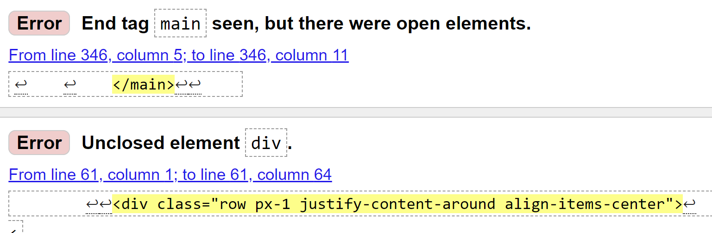

## **Testing**

### **Notable Bugs Occurring During Development**
During the development phase of the site, I encountered a number of significant bugs while testing the output of my code. They were all mistakes which led to important lessons learned for future projects. These are documented below:

### **Issues with Holiday Pros/Cons Data Submission to Backend**
When the `write_review` python function was first implemented, an issue occurred with how the holiday pros and cons were sent to the database. When a review was subsequently viewed by a user, the holiday pros and cons were appearing as separate individual letters of the first pro/con submitted. A visual of this is shown below:

 

This bug was caused by how the data was being retrieved from the `write_review.html` form. Originally I was using `list(request.form.get('holiday_pros'))` as my method to extract the data. After researching online, I adjusted this to `request.form.getlist('holiday_pros')` in order to correct the issue.

### **Cropped Headers in Review Cards**
In order to test the durability of the layout of the review cards on the **profile** page, I wrote a review of a location with a very long name (Llanfairpwllgwyngyll in Wales) in order to see how it would appear on the site. As expected, some of the elements of the review header would overflow when displayed on a phone screen, as shown below:

 

In order to manage this issue, I researched the bootstrap documentation and fopund a class called `text-truncate` which could be used to make the report appear in a more tidy fashion. The final appearance is below:

### **HTML Validator Results**
In order to validate the quality of my HTML Code, I passed it through the [W3C HTML Validator](https://validator.w3.org/) for all pages of my site to ensure there were no major issues. As there is Jinja templating code throughout the html pages, source code was taken from the rendered pages and passed into the validator (Rather than passing it a URL). Below are the results:

`index.html`  
No errors or warnings

`register.html`  
Two errors:
  

* This was a typo mistake

* This was a mistake made when customizing a bootstrap component for the select element of the register form. It was corrected by changing the `aria-describedby` attribute to point to the label for the username input field

`login.html`  
No errors or warnings

`profile.html`  
No errors or warnings

`read_review.html`  
Three errors:

* This was human error mistake, corrected by removing

  

* This were both linked and caused by human error. The unclosed `div` tag was corrected

`write_review.html`   
Five errors & 1 warning:

  

* These were both linked to the **cost** rating slider which the user can adjust. The reason for the "pattern" error is a human error mistake, this was corrected by removing. The reason for the attribute "required" error was intentional, I wanted to ensure the user selects a value for this field. Since this is not allowed, I removed it and kept the min value of the field equal to 1, so that something is always submitted to the back end.

  

* This duplicate declaration was caused by human error, corrected by removing the id from both elements

  

* These were both linked to the **review** rating slider which the user can adjust. The reason for the "pattern" error is a human error mistake, this was corrected by removing. The reason for the attribute "required" error was intentional, I wanted to ensure the user selects a value for this field. Since this is not allowed, I removed it and kept the min value of the field equal to 1, so that something is always submitted to the back end.

`edit_review.html`  
2 errors:

  

* This was accidentally caused by duplicate options in the select element for "Holiday Type" containing the **selected** attribute. This was corrected by removing the incorrectly added attribute.

  

* This was a typo mistake

`charts.html`  
84 errors:

* These errors were caused by multiple stray end tags for `span` elements in the lowest costs chart. They were cloned multiple times because of the amount of currency elements on the page when it is generated. They were easily corrected in the template. the page was passed through the validator again and came out with no errors

`reviews.html`  
2 errors:

  

* This were both linked and caused by human error. The unclosed `div` tag was corrected

### **CSS Validator Results**
In order to validate the quality of my CSS Code, I passed it through the [W3C CSS Validator](https://jigsaw.w3.org/css-validator/). No errors or warnings were found.

### **JavaScript Validator Results**
In order to validate the quality of my JavaScript Code, I passed it through the [Jshint linter](https://jshint.com/). No erros were found. Nine warnings ocurred for missing semicolons in bootstrap code that I used. I corrected these so the warnings do not appear.

### **Python Validator Results**
In order to validate the quality of my Python Code in `app.py`, I passed it through a [PEP8 online checker](https://pep8online.com//). [Initial results](documents/testing/python-val.png) showed 12 lines with **line too long (> 79 characters)** errors. I wnet through each affected line one by one and made adjustments in order to address these errors. The majority of cases were caused by the return statement for each of my functions. The `render_template` method I was returning as output took in alot of parameters which caused the line to exceed 79 characters. I could easily address these cases by breaking the line into multiple segments.

One case did appear which was slightly more difficult to correct. if was caused by some conditional logic. It is pictured below:

  

The logic is neccessary for the subsequent calculations and I couldnt break the line into multiple segments. Therefore I chose the  `review['location'].lower()` condition that was being checked to a variable called `rev_location`.

After these adjustments were made, I passed the new code thorugh the checker once more and got an [**all right**](documents/testing/python-val-final.png) result.

### Lighthouse Performance Results
In order to assess the performance of my site I ran a lighthouse review on both the mobile and desktop versions of each page in the site. Below are the results:

`index.html` 
* Mobile:  
 

* Desktop:  
 

`register.html` 
* Mobile:  
 

* Desktop:  
 

`login.html`
* Mobile:  
 

* Desktop:  
 

`profile.html`
* Mobile:  
 

* Desktop:  
 

`read_review.html`
* Mobile:  
 

* Desktop:  
  

`write_review.html`
* Mobile:  
 

* Desktop:  
  

`edit_review.html`  
* Mobile:  
 

* Desktop:  
  

`charts.html`
* Mobile:  
 

* Desktop:  
  

`reviews.html`
* Mobile:  
 

* Desktop:  
  

### User Stories Validation

### Remaining Unfixed Bugs