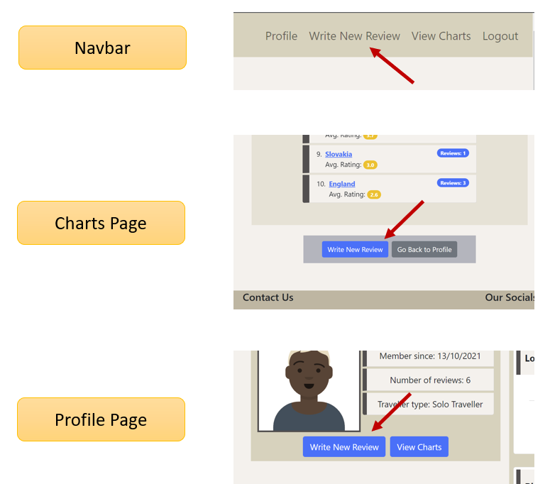
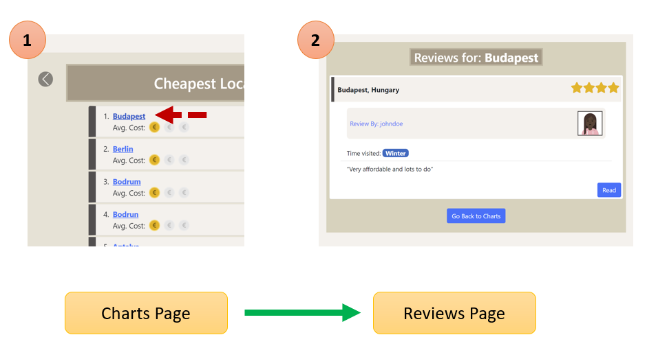

## **Testing**

### **Notable Bugs Occurring During Development**
During the development phase of the site, I encountered a number of significant bugs while testing the output of my code. They were all mistakes which led to important lessons learned for future projects. These are documented below:

### **SSL Certificate Issues**
When initially connecting my project to my MongoDB database using **pymongo**, I was encountering an error which stated `[SSL: CERTIFICATE_VERIFY_FAILED] certificate verify failed`. With the help of Tutor support, I discovered the solution to get around this issue was to add the string **“&ssl=true&ssl_cert_reqs=CERT_NONE”** to the end of my Mongo URI. The reason behind this issue was unfortunately beyond my understanding but I plan to further research it online after this project is completed.

  

  

### **Issues with Holiday Pros/Cons Data Submission to Backend**
When the `write_review` python function was first implemented, an issue occurred with how the holiday pros and cons were sent to the database. When a review was subsequently viewed by a user, the holiday pros and cons were appearing as separate individual letters of the first pro/con submitted. A visual of this is shown below:

 

This bug was caused by how the data was being retrieved from the `write_review.html` form. Originally I was using `list(request.form.get('holiday_pros'))` as my method to extract the data. After researching online, I adjusted this to `request.form.getlist('holiday_pros')` in order to correct the issue.

### **Cropped Headers in Review Cards**
In order to test the durability of the layout of the review cards on the **profile** page, I wrote a review of a location with a very long name (Llanfairpwllgwyngyll in Wales) in order to see how it would appear on the site. As expected, some of the elements of the review header would overflow when displayed on a phone screen, as shown below:

 

In order to manage this issue, I researched the bootstrap documentation and fopund a class called `text-truncate` which could be used to make the report appear in a more tidy fashion. The final appearance is below:

### **HTML Validator Results**
In order to validate the quality of my HTML Code, I passed it through the [W3C HTML Validator](https://validator.w3.org/) for all pages of my site to ensure there were no major issues. As there is Jinja templating code throughout the html pages, source code was taken from the rendered pages and passed into the validator (Rather than passing it a URL). Below are the results:

`index.html`  
No errors or warnings

`register.html`  
Two errors:
  

* This was a typo mistake

* This was a mistake made when customizing a bootstrap component for the select element of the register form. It was corrected by changing the `aria-describedby` attribute to point to the label for the username input field

`login.html`  
No errors or warnings

`profile.html`  
No errors or warnings

`read_review.html`  
Three errors:

* This was human error mistake, corrected by removing

  

* These were both linked and caused by human error. The unclosed `div` tag was corrected

`write_review.html`   
Five errors & 1 warning:

  

* These were both linked to the **cost** rating slider which the user can adjust. The reason for the "pattern" error is a human error mistake, this was corrected by removing. The reason for the attribute "required" error was intentional, I wanted to ensure the user selects a value for this field. Since this is not allowed, I removed it and kept the min value of the field equal to 1, so that something is always submitted to the back end.

  

* This duplicate declaration was caused by human error, corrected by removing the id from both elements

  

* These were both linked to the **review** rating slider which the user can adjust. The reason for the "pattern" error is a human error mistake, this was corrected by removing. The reason for the attribute "required" error was intentional, I wanted to ensure the user selects a value for this field. Since this is not allowed, I removed it and kept the min value of the field equal to 1, so that something is always submitted to the back end.

`edit_review.html`  
2 errors:

  

* This was accidentally caused by duplicate options in the select element for "Holiday Type" containing the **selected** attribute. This was corrected by removing the incorrectly added attribute.

  

* This was a typo mistake

`charts.html`  
84 errors:

* These errors were caused by multiple stray end tags for `span` elements in the lowest costs chart. They were cloned multiple times because of the amount of currency elements on the page when it is generated. They were easily corrected in the template. the page was passed through the validator again and came out with no errors

`reviews.html`  
2 errors:

  

* This were both linked and caused by human error. The unclosed `div` tag was corrected

### **CSS Validator Results**
In order to validate the quality of my CSS Code, I passed it through the [W3C CSS Validator](https://jigsaw.w3.org/css-validator/). No errors or warnings were found.

### **JavaScript Validator Results**
In order to validate the quality of my JavaScript Code, I passed it through the [Jshint linter](https://jshint.com/). No errors were found. Nine warnings ocurred for missing semicolons in bootstrap code that I used. I corrected these so the warnings do not appear.

### **Python Validator Results**
In order to validate the quality of my Python Code in `app.py`, I passed it through a [PEP8 online checker](https://pep8online.com//). [**Initial results**](documents/testing/python-val.png) showed 12 lines with **line too long (> 79 characters)** errors. I wnet through each affected line one by one and made adjustments in order to address these errors. The majority of cases were caused by the return statement for each of my functions. The `render_template` method I was returning as output took in alot of parameters which caused the line to exceed 79 characters. I could easily address these cases by breaking the line into multiple segments.

One case did appear which was slightly more difficult to correct. if was caused by some conditional logic. It is pictured below:

  

The logic is neccessary for the subsequent calculations and I couldnt break the line into multiple segments. Therefore I chose to change the `review['location'].lower()` condition that was being checked to a variable called `rev_location`.

After these adjustments were made, I passed the new code thorugh the checker once more and got an ["**all right**"](documents/testing/python-val-final.png) result.

### Lighthouse Performance Results
In order to assess the performance of my site I ran a lighthouse review on both the mobile and desktop versions of each page in the site. Below are the results:

`index.html` 
* Mobile:  
 

* Desktop:  
 

`register.html` 
* Mobile:  
 

* Desktop:  
 

`login.html`
* Mobile:  
 

* Desktop:  
 

`profile.html`
* Mobile:  
 

* Desktop:  
 

`read_review.html`
* Mobile:  
 

* Desktop:  
  

`write_review.html`
* Mobile:  
 

* Desktop:  
  

`edit_review.html`  
* Mobile:  
 

* Desktop:  
  

`charts.html`
* Mobile:  
 

* Desktop:  
  

`reviews.html`
* Mobile:  
 

* Desktop:  
  

### **User Stories Validation**

**Site Viewer**
1. *I want to be able to create an account on HolidayHub*  
When the user first visits the site they are presented with a call to action panel on an index page. This panel contains a link to the **register** page of the site where the user has the ability to create an account. The user is prompted to create a username, a password and choose what type of holidays they normally enjoy. The holiday type determines their "traveller type" on their user profile statistics. For example, if the user chooses "cultural getaways" then they will be displayed as a "sophisticated tourist" traveller type on their profile. The user is also able to navigate to the **register** page via a link on the **login** page   
 

2. *I want to be able to log in to my account on HolidayHub*  
When the user first visits the site they are presented with a call to action panel on an index page. This panel contains a link to the **login** page of the site where the user has the ability to log into their previosuly created account. The user is also able to navigate to this page via a link on the **register** page    
 

3. *I want to be able to log out of my account on HolidayHub*  
Once logged in, the user can easily log out of the site by selecting the **Log Out** button that is visible in the navbar. Once they select this option, they will then be redirected to the **login** page of the site.  
 

4. *I want to be view my profile on HolidayHub*  
Once the user has registered on the site, they are immediately sent to their own personal **profile** page. They are also able to navigate back to this page by using the navbar at any point. On the **charts**,**read_review** and **edit_review** pages of the site, there is a button present which the user can use to redirect back to their personal profile. 

5. *I want to write a review on HolidayHub*  
The buttons to write a review is found in the users **profile** page, the **charts** page and the navbar of the site. When any of these buttons are pressed, the user is brought to a **write_review** page where there is a form present that they can fill out with their review.  
 

6. *I want to edit a review on HolidayHub*  
This user story is satisfied when the user is viewing their **profile** page on the site. The page displays all reviews written by the user. There are three actionable buttons available for each review. One of these buttons is **Edit**. When the user clicks this button they can
 

7. *I want to delete a review on HolidayHub*  
This user story is satisfied when the user is viewing their **profile** page on the site. The page displays all reviews written by the user. There are three actionable buttons available for each review. One of these buttons is **Delete**. The user can press this button if they choose to remove associated review from the site. Defensive programming is implemented via a warning modal which double checks with the user if they are certain that they want the particular review deleted.  
 

8. *I want to see other users reviews on HolidayHub*  
This user story is satisfied when the user is navigating through the **charts** section of the site. In this page the user can select a location/country they want to see all user submitted reviews for. When chosen, they will then be brought to a **review** page which shows all reviews for that particular location.

9. *I want to see other users reviews by country on HolidayHub*  
When viewing the "Top Overall Rated Countries" chart that is located in the **charts** page of the site, the user can select a country to see all reviews submitted for the particular country.  
 

10. *I want to see other users reviews by location on HolidayHub*  
When viewing the "Best Locations for Food" and the "Cheapest Reviews" charts that are located in the **charts** page of the site, the user can select a location to see all reviews submitted for the particular location.  
 

11. *I want to see the best locations for food on HolidayHub*  
This story is satisfied on the **charts** page of the site. There is a chart titled "Best Locations for Food" which shows the best rated locations which had reviews that included food as one of the holiday pros. 

12. *I want to see the cheapest rated locations on HolidayHub*  
This story is satisfied on the **charts** page of the site. There is a chart titled "Cheapest Locations" which shows the cheapest rated locations based on the cost ratings of the locations reviews. 

13. *I want to see the best rated countries on HolidayHub*  
This story is satisfied on the **charts** page of the site. There is a chart titled "Top Overall Rated Countries" which shows the best rated countries based on their average review score. 

14. *I want the process of writing a review to be simple and intuitive*  
Writing a review is easily accessible from the users' profile page and navbar of the site. When writing all neccessary input fields are well structured and layed out. An intuitive slider system is used to enable the user to select the cost rating and review star rating of the location beign reviewed. Multiple elements can be selected when choosing the pros and cons of the holiday.

15. *I want the process of reading another users' review to be interesting and visually appealling*  
The appearance of other users reviews is both visually pleasant and insightful. The colorful elements used to show the pros, cons, cost rating and review score of the site are effective in that they catch the viewers eye while also conveying the most pertinent details of the review. The well structured comment section of the review allows the viewer to get more detailed information easily if they chose to read on.  
 

16. *I want to view another person's profile on HolidayHub*  
This user story is satisfied when the user is navigating through the **charts** section of the site. In this page the user can select a location they want to see all reviews for. When chosen, they will then be brought to a **review** page which shows all reviews for that particular location. While looking at other peoples reviews, the user can choose to view their profile. they will then be brought to a **profile** page for that user, which details profile stats and all reviews written by that user.  
 

**Site Owner**
1. *I want to provide unbiased, user driven travel advice*  
This user story is satisfied in the **charts** section of the site. This page aggregates all user reviews a provides charts which detail what the most well reviewed locations are. The charts are not determined by the owner of the site. User data will determine what appears in these charts.    
 

2. *I want to create opportunities to generate revenue by promoting traffic to affiliate links accomodation booking sites*  
This story is satisfied on the **read_review** page of the site. A vibrant orange affiliate link button is visible below the heading of every review on the site. The button prompts the user towards booking a holiday for the location in the review on the affiliate's website. For the purpose of this assignment, a fake affiliate holiday booking website was created called "HolidayBook". The logo was designed using [canva](https://www.canva.com/)  
  

### **Remaining Unfixed Bugs**